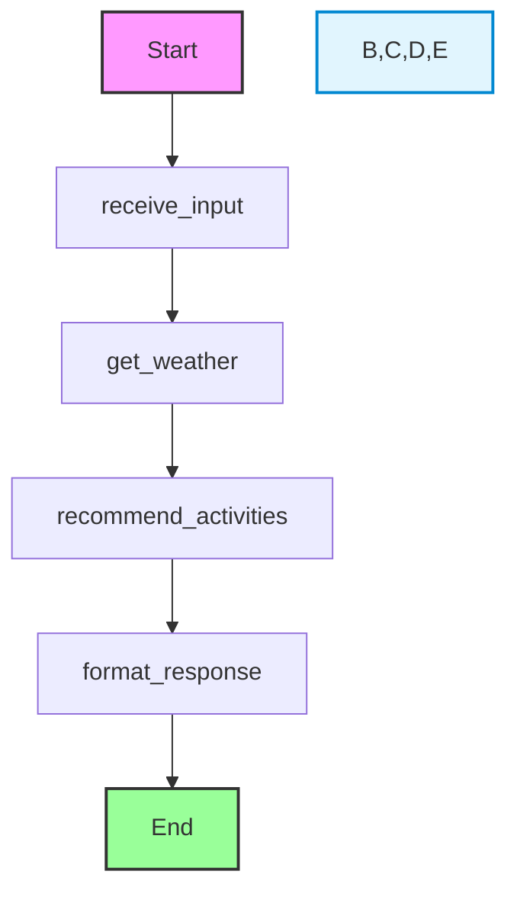

# Kaiban A2A Agent Starter (Python)

[](https://www.python.org/)
[](https://github.com/google/a2a-protocol)
[](LICENSE)

A production-ready starter template for building A2A agents that integrate with the [Kaiban platform](https://kaiban.io) using **Python**.

This is the **Python example** of Kaiban integration. For the TypeScript/JavaScript example, see [kaiban-a2a-agent-starter](../kaiban-a2a-agent-starter).

## Overview

This project implements a weather agent using LangChain and LangGraph that can fetch weather information for a city and recommend activities based on the weather conditions. The agent communicates using the A2A (Agent-to-Agent) protocol and integrates seamlessly with Kaiban platform.

## Features

- ✅ **Full Kaiban Integration**: Complete integration with Kaiban platform using A2A protocol
- ✅ **Weather Agent**: Fetches real weather data and provides activity recommendations
- ✅ **A2A Protocol**: Implements the official A2A Python SDK
- ✅ **Kaiban SDK**: Custom Python client for Kaiban API
- ✅ **FastAPI Server**: Modern async web server for A2A endpoints
- ✅ **Comprehensive Logging**: Structured logging for debugging and monitoring

## Quick Start

1. **Install dependencies:**
   ```bash
   python -m venv .venv
   source .venv/bin/activate  # On Windows: .venv\Scripts\activate
   pip install -r requirements.txt
   ```

2. **Configure environment:**
   ```bash
   cp .env.example .env
   # Edit .env with your credentials
   ```

3. **Start the A2A server:**
   ```bash
   python main.py
   ```

4. **Create agent in Kaiban** with the configuration from `KAIBAN_INTEGRATION.md`

For detailed setup and configuration instructions, see [KAIBAN_INTEGRATION.md](./KAIBAN_INTEGRATION.md).

## Project Structure

```
kaiban-a2a-agent-starter-py/
├── agent/
│   ├── a2a_integration/      # A2A protocol integration
│   │   ├── card.py           # AgentCard definition
│   │   ├── executor.py       # WeatherAgentExecutor
│   │   └── server.py         # FastAPI server setup
│   ├── kaiban_integration/   # Kaiban platform integration
│   │   ├── client.py         # KaibanClient (HTTP client)
│   │   └── controller.py     # WeatherController
│   └── weather_agent.py      # Core weather agent logic
├── main.py                    # Application entry point
├── requirements.txt           # Python dependencies
├── .env.example               # Environment configuration template
├── README.md                  # This file
└── KAIBAN_INTEGRATION.md     # Detailed integration documentation
```

## Features

- Fetches current weather data for any city using Open-Meteo API (completely free, no API key required)
- Supports mock weather data for testing
- Uses OpenAI's GPT-4 for personalized activity recommendations
- Implements the A2A protocol for agent communication
- Built with LangChain and LangGraph for agent orchestration
- Full Kaiban platform integration with card workflow management

## Architecture

The agent is built using LangGraph with the following workflow:



### Node Descriptions:

1. **receive_input**: 
   - Processes the user's input message
   - Extracts the city name from the query
   - Initializes the conversation state

2. **get_weather**:
   - Fetches weather data for the specified city
   - Uses either Open-Meteo API (free, no API key) or mock data based on configuration
   - Returns structured weather information

3. **recommend_activities**:
   - Uses OpenAI's GPT-4 to generate personalized activity suggestions
   - Takes into account weather conditions and temperature
   - Falls back to default suggestions if API is unavailable

4. **format_response**:
   - Structures the final response in a2a protocol format
   - Includes weather data and recommended activities
   - Returns a well-formatted JSON response

## Prerequisites

- Python 3.8+
- (Optional) OpenAI API key (for AI-powered recommendations)
- **No weather API key required** - Uses Open-Meteo (completely free)

## Installation

1. Clone the repository
2. Create and activate a virtual environment:
   ```bash
   python -m venv .venv
   source .venv/bin/activate  # On Windows: .venv\Scripts\activate
   ```
3. Install the required dependencies:
   ```bash
   pip install -r requirements.txt
   ```
4. Create a `.env` file in the project root and add your API keys (optional):
   ```
   # Optional: Only needed for AI-powered recommendations
   OPENAI_API_KEY=your_openai_api_key_here
   ```
   
   **Note:** Weather data uses Open-Meteo which is completely free and doesn't require an API key!

## Usage

### Basic Usage with Mock Data

```python
from weather_agent import WeatherAgent

# Initialize the agent with mock weather data (default)
agent = WeatherAgent()

# Get weather and recommendations
response = agent.process("What's the weather like in Paris?")
print(response)
```

### Using Real Weather Data

```python
from weather_agent import WeatherAgent

# Initialize the agent with real weather data (no API key needed!)
agent = WeatherAgent(use_real_weather=True)

# Get weather and recommendations
response = agent.process("What's the weather like in Tokyo?")
print(response)
```

### Example Response

```json
{
  "type": "weather_recommendation",
  "city": "Paris",
  "weather": {
    "description": "few clouds",
    "temperature": 23.6,
    "unit": "celsius"
  },
  "recommended_activities": [
    "Visit the Eiffel Tower and enjoy the view from the top",
    "Take a leisurely boat cruise along the Seine River",
    "Explore the charming streets of Montmartre",
    "Visit the Louvre Museum and see the Mona Lisa",
    "Have a picnic in the Luxembourg Gardens"
  ]
}
```

### a2a Protocol Format

The agent communicates using the following a2a protocol format:

```json
{
  "type": "weather_recommendation",
  "city": "Paris",
  "weather": {
    "description": "clear sky",
    "temperature": 22.5,
    "unit": "celsius"
  },
  "recommended_activities": [
    "Visit a museum",
    "Go to a cafe",
    "Take a river cruise"
  ]
}
```

### Example Interaction

```
You: What's the weather like in Tokyo?

Agent: {
  "type": "weather_recommendation",
  "city": "Tokyo",
  "weather": {
    "description": "few clouds",
    "temperature": 19.5,
    "unit": "celsius"
  },
  "recommended_activities": [
    "Go for a walk in the park",
    "Visit outdoor markets",
    "Explore the city"
  ]
}
```

## Architecture

The agent is built using LangGraph with the following nodes:

1. `receive_input`: Processes the initial user input and extracts the city
2. `get_weather`: Fetches weather data from Open-Meteo API (free, no API key required)
3. `recommend_activities`: Suggests activities based on weather conditions
4. `format_response`: Formats the response according to the a2a protocol

## Extending the Agent

To extend the agent with additional functionality:

1. Add new nodes to the graph using `workflow.add_node()`
2. Define the edges between nodes
3. Update the state management as needed

## License

MIT
